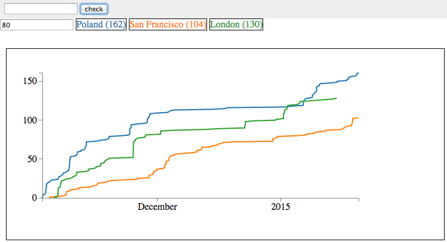

# Wikipedia Edit History

Explore edit history of Wikipedia pages. Compare a few pages and plot their edit activity in a given time window. 

[Interactive version.](http://stared.github.io/wikipedia_edit_hist/)

Using Angular.js and D3.js.

As of now it looks more or less like (WARNING: work in progress!):

